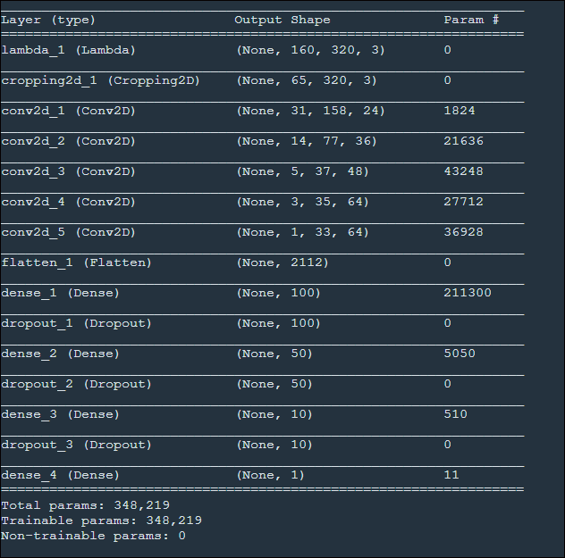

# **Behavioral Cloning** 

## Writeup

**Behavioral Cloning Project**

The goals / steps of this project are the following:
* Use the simulator to collect data of good driving behavior

* Build, a convolution neural network in Keras that predicts steering angles from images

* Train and validate the model with a training and validation set

* Test that the model successfully drives around track one without leaving the road

* Summarize the results with a written report

  

## Rubric Points
### Here I will consider the [rubric points](https://review.udacity.com/#!/rubrics/432/view) individually and describe how I addressed each point in my implementation.  

---
### Files Submitted & Code Quality

#### 1. Submission includes all required files and can be used to run the simulator in autonomous mode

My project includes the following files:
* model.py containing the script to create and train the model
* drive.py for driving the car in autonomous mode
* model.h5 containing a trained convolution neural network 
* writeup_report.md or writeup_report.pdf summarizing the results
* track1.MP4 video file proving the model on track1
* track2.MP4 video file proving model on track2

#### 2. Submission includes functional code
Using the Udacity provided simulator and my drive.py file, the car can be driven autonomously around the track by executing 
```sh
python drive.py model.h5
```

#### 3. Submission code is usable and readable

The model.py file contains the code for training and saving the convolution neural network. The file shows the pipeline I used for training and validating the model, and it contains comments to explain how the code works.

### Model Architecture and Training Strategy

#### 1. An appropriate model architecture has been employed

My model consists of a convolution neural network with 5x5 and 3x3 filter sizes and depths between 24and 64(model.py lines 96-110)

The model includes RELU layers to introduce nonlinearity (code line 99), and the data is normalized in the model using a Keras lambda layer (code line 97). 

#### 2. Attempts to reduce overfitting in the model

The model contains dropout layers in order to reduce overfitting (model.py lines 21). 

The model was trained and validated on different data sets to ensure that the model was not overfitting (code line 10-16). The model was tested by running it through the simulator and ensuring that the vehicle could stay on the track.

#### 3. Model parameter tuning

The model used an adam optimizer, so the learning rate was not tuned manually (model.py line 25).

#### 4. Appropriate training data

Training data was chosen to keep the vehicle driving on the road. I used a combination of center lane driving, recovering from the left and right sides of the road.  

For details about how I created the training data, see the next section. 

### Model Architecture and Training Strategy

#### 1. Solution Design Approach

My first step was to use a convolution neural network model similar to the lenet architecture described in the class. It is a powerful model with deep enough layers to tackle the various road conditions and variations. While it performed fine with smaller training data, the performance couldn't be replicated with larger data set when many scenarios had been captured in the training data. Here is the summary of the modified lenet, with dropouts added after dense layers.


Moving on, I implemented the NVIDIA team model as suggested in the class with a couple of variations.

In order to gauge how well the model was working, I split my image and steering angle data into a training and validation set with 80% and 20% of the images respectively.

I noted down in the 'progress' section of the README.md all the steps I have taken to come to the final model and data augmentation. I found that my first model had a low mean squared error on the training set but a high mean squared error on the validation set. This implied that the model was overfitting. 

To combat the overfitting, I modified the model by adding additional dropout layers after the dense layers

The final step was to run the simulator to see how well the car was driving around track one. There were a few spots where the vehicle fell off the track, I took a few data points around that region to improve the driving behavior in these cases.

At the end of the process, the vehicle is able to drive autonomously around the track without leaving the road.

#### 2. Final Model Architecture

The final model architecture (model.py lines 18-24) consisted of a convolution neural network with the following layers and layer sizes -

- convolutional layer with filter depth as 24 and filter size as (5,5) with (2,2) stride followed by RELU activation function
- convolutional layer with filter depth as 36and filter size as (5,5) with (2,2) stride followed by RELU activation function
- convolutional layer with filter depth as 48 and filter size as (5,5) with (2,2) stride followed by RELU activation function
- convolutional layer with filter depth as 64 and filter size as (3,3) followed by RELU activation function
- convolutional layer with filter depth as 64 and filter size as (3,3) followed by RELU activation function
- Then a flatten layer to convert from 2D to 1 dimension 
- A fully connected layer with 100 outputs
- A dropout layer with 50% dropouts to reduce overfitting
- A fully connected layer with 50 outputs
- A dropout layer with 50% dropouts to reduce overfitting
- A fully connected layer with 10 outputs
- A final dropout layer with 50% dropouts 
- The final 1 output layer for the steering angle

Here is a visualization of the architecture (note: visualizing the architecture is optional according to the project rubric)



#### 3. Creation of the Training Set & Training Process

To capture good driving behavior, I first recorded two laps on track one using center lane driving. Here is an example image of center lane driving:


I then recorded the vehicle recovering from the left side and right sides of the road back to center so that the vehicle would learn to correct itself from offcenter :


Then I repeated this process on track two in order to get more data points, when I finally had ~28000 images to work with. This is the distribution of the data before any data augmentation.


To augment the data sat, I also flipped images and angles thinking that this would as this would be a quick way to mimic the data driving the other way on the track

The center images have been augmented with the left and right camera images by adding and subtracting respectively the steering angle by a factor of 0.3.

After the collection process, I had ~96000 number of data points. I then preprocessed this data by deleting the top 70 pixels and bottom 20 pixels of the images since they do not provide any valid features.


I finally randomly shuffled the data set and put 20% of the data into a validation set. 

I used this training data for training the model. The validation set helped determine if the model was over or under fitting. The ideal number of epochs was 10 as evidenced by the final val_loss values given the README.md.  I used an adam optimizer so that manually training the learning rate wasn't necessary.

I tried to remove a few data points where the steering angle was zero to optimize the data spread (lines 22-26). I commented out the code since it did not add significant improvement to the training.

I also tried to delete a few data points randomly irrespective of the steering angle to generalize the data more. This too hasn't resulted in any significant change. So commented it out (lines 29 - 35)